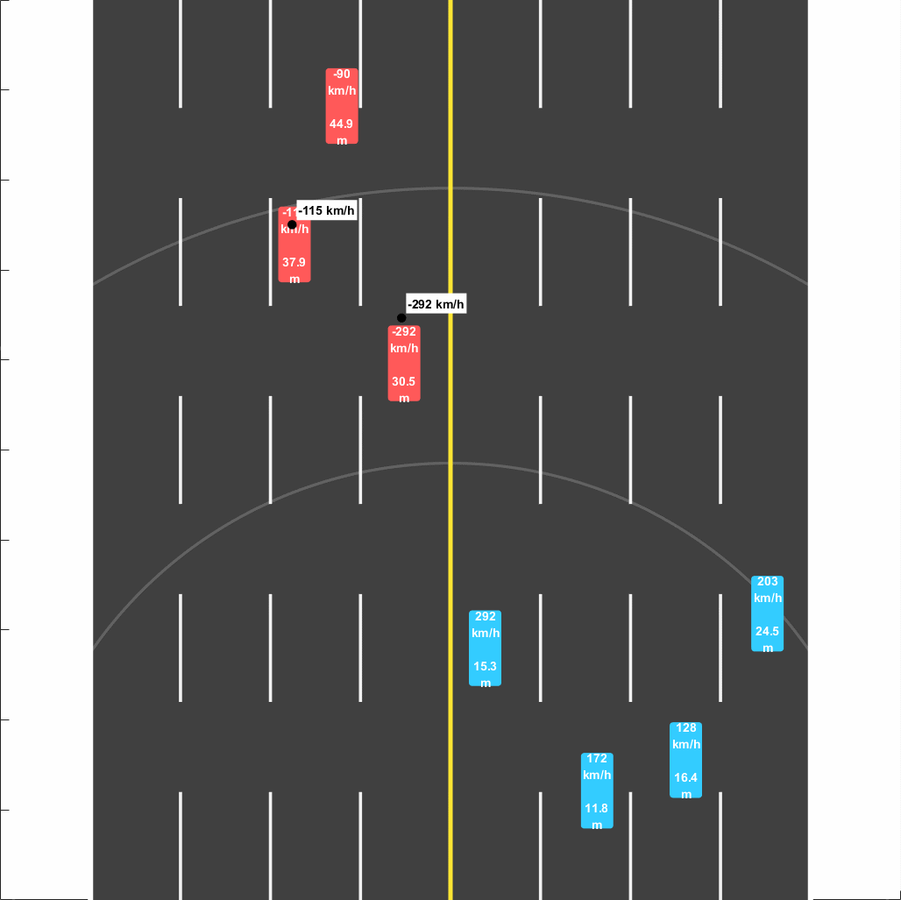
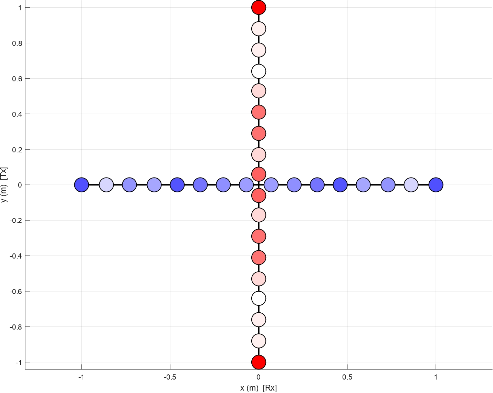
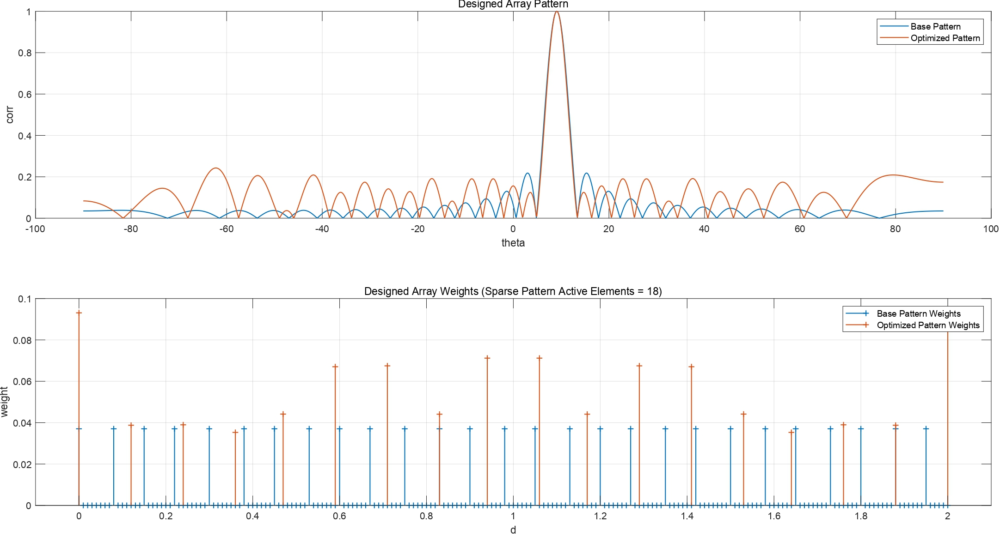

# Cross-Array Radar Speed Detection and Localization

This project simulates a *cross-array* radar mounted on a highway median, detects vehicles, estimates their **range / radial speed / azimuth**, and converts detections into **(x, y) position / speed** to cue a center-mounted camera.


<table align="center" width="100%">
  <tr>
    <td align="center" width="37%">
      <figure style="margin:0;">
        
        <figcaption><em>Simulation environment</em></figcaption>
      </figure>
    </td>
    <td align="center" width="62%">
      <figure style="margin:0;">
        
        <figcaption><em>Real-time range–Doppler matrix</em></figcaption>
      </figure>
    </td>
  </tr>
</table>


## Contents

- [Cross-Array Radar Speed Detection and Localization](#cross-array-radar-speed-detection-and-localization)
  - [Contents](#contents)
  - [System at a Glance](#system-at-a-glance)
  - [Key Design Parameters](#key-design-parameters)
    - [Radar / Processing](#radar--processing)
    - [Constraints](#constraints)
  - [How It Works](#how-it-works)
    - [1) Scenario \& Geometry](#1-scenario--geometry)
    - [2) Signal Transmission and Reception](#2-signal-transmission-and-reception)
    - [3) Range–Doppler Processing](#3-rangedoppler-processing)
    - [4) Peak Picking + Matching Pursuit Angle Estimation](#4-peak-picking--matching-pursuit-angle-estimation)
    - [5) Cartesian Localization \& Speed Estimation](#5-cartesian-localization--speed-estimation)
  - [Repository Structure](#repository-structure)
  - [Getting Started](#getting-started)
    - [Installation](#installation)
    - [Quickstart](#quickstart)


## System at a Glance

**Pipeline:**

1. Generate vehicles on an 8-lane highway with random speeds/accelerations
2. Synthesize received multi-channel baseband radar data (delay + Doppler per target + noise)
3. Compute a **range–Doppler map**
4. Detect peaks
5. Estimate **angle** via a spatial **Matching Pursuit (MP)** step
6. Convert to **(x, y)** and estimate true speed from radial speed + geometry

## Key Design Parameters

> These are the **default/reference** parameters used.

### Radar / Processing
- Carrier frequency: **2 GHz**
- Bandwidth: **20 MHz**
- Sampling rate: **100 MHz**
- Recording time: **0.1 s**
- PRI: **4e-4 s**  → PRF: **2.5 kHz**
- Transmit power: **10 mW**

### Constraints
- Camera usable range: **40 m**
- Max target speed (design): **300 km/h**
- Cross-array size constraint: **≤ 2 m × 2 m**
- Element spacing: **≥ 8 cm**
- Noise figure: **5 dB**


## How It Works

### 1) Scenario & Geometry

The environment is a straight highway in the ground plane **(x, y)**:
- 8 lanes with opposite directions of traffic
- Each vehicle spawns with random lane, lateral offset, speed, and acceleration
- At each simulation step, vehicles move, some respawn, and their geometry relative to the radar is updated


### 2) Signal Transmission and Reception

A base signal is modeled as a repeated **linear-FM (chirp)** pulse train. This signal is then transmitted via a pre-designed tx array (solving an optimization problem, which the code can be find in `src/Generate_Tx_Array.m`). By modeling the cars position and velocity, the reflected signal is then received by an rx array. (which its elements and positions are determind using `src/Generate_Rx_Array.m`)


<table align="center" width="100%">
  <tr>
    <td align="center" width="50%">
      <figure style="margin:0;">
        
        <figcaption><em>Final cross-array geometry.</em></figcaption>
      </figure>
    </td>
    <td align="center" width="50%">
      <figure style="margin:0;">
        
        <figcaption><em>Designed Tx Array Pattern.</em></figcaption>
      </figure>
    </td>
  </tr>
</table>

### 3) Range–Doppler Processing

The recording is segmented into pulses (slow-time) with fast-time samples per PRI:

1. **Range compression** via matched filtering (FFT-based)
2. **Doppler FFT** across pulses to form the range–Doppler map


### 4) Peak Picking + Matching Pursuit Angle Estimation

Because only a limited number of cars exist in the gated region, the range–Doppler map is **sparse**.

- Find local maxima above a threshold as candidate detections
- For each detected cell, stack per-antenna coefficients to form a spatial snapshot
- Correlate with a steering-vector dictionary and pick the best match (**Matching Pursuit**)

This produces a per-target **azimuth estimate** used for localization.


### 5) Cartesian Localization & Speed Estimation

Each detected peak becomes:
- **Range** from the delay bin
- **Radial velocity** from Doppler

Then use the MP azimuth plus known radar height to compute **(x, y)** and estimate the true speed magnitude.


## Repository Structure

- [`conf/`](conf) – configuration files (precomputed arrray elements' weights and positionss)
- [`src/`](src) – core MATLAB functions (signal synthesis, processing, estimation)
- [`scripts/`](scripts) – runnable entry scripts (simulation runs)
- [`images/`](images) – images for documentation (in .jpg)
- [`figures/`](figures) – exported figures (in .pdf)
- [`gifs/`](gifs) – animation demos


## Getting Started


### Installation

```bash
git clone https://github.com/salar-sfd/Cross-Array-Radar-Speed-Detection-and-Localization.git
cd Cross-Array-Radar-Speed-Detection-and-Localization
```

### Quickstart

1) Open MATLAB, set the project root as the current folder  
2) Add the project to MATLAB path:

```matlab
addpath(genpath(pwd));
```

3) Run a top-level simulation script from `scripts/main.m`:
